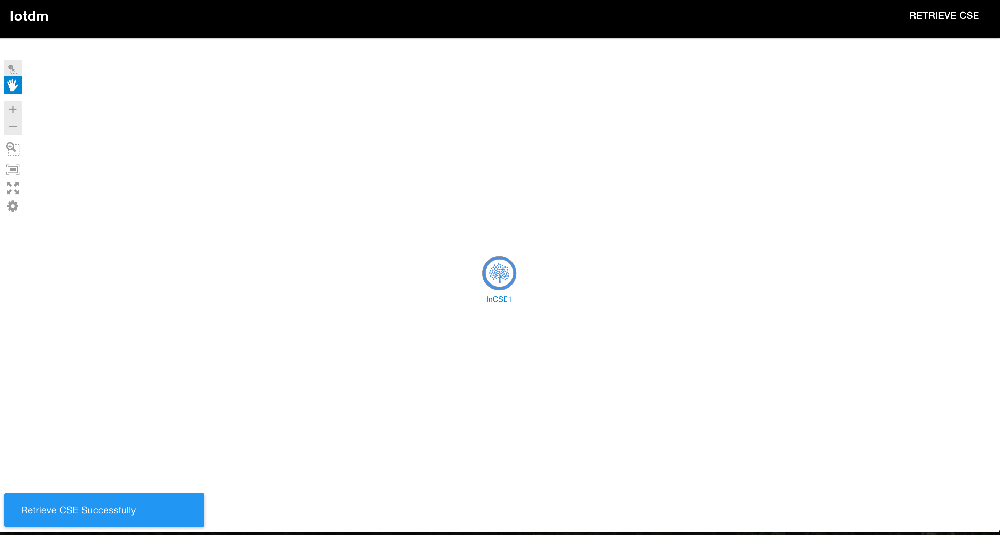
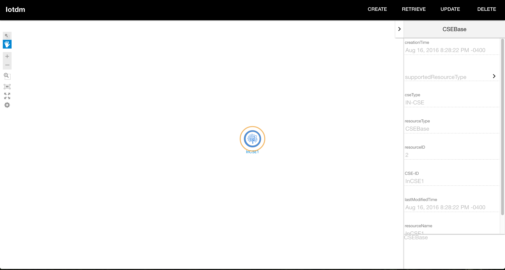

#Iotdm-GUI

The IoT Data Management (IoTDM) project is an open source implementation of oneM2M running on OpenDayLight. It is about developing a data-centric middleware that will act as a oneM2M compliant IoT Data Broker and enable authorized applications to retrieve IoT data uploaded by any device. Iotdm-GUI is an tree-view ODL application which manipulates Onem2m data from IoTDM.  

##Team:
- Lionel Florit
- John Burns
- Wenxin Shi
- Cangji Wu

### Social Tags:
IOT, Opendaylight, oneM2M

### Project Kick-off Date:
Jan 2016

### Current Status:
In development. The stable first version with basic functionality is finished. Next version will include some advanced features.

##Overview
The data models of Iotdm are in consistent with the Onem2m standands, which is new merged IOT standards address the need for a common M2M Service Layer that can be readily embedded within various hardware and software. However, the complexity of data model and communcation mechanism of Onem2m can be huge barrier for user to know what and how to use Iotdm in the beginning. 

Iotdm-GUI is an application encapsulating all the Onem2m Complexity through simple form-based way to assemble the data model and tree-view approach to visualize the relations among the nodes(data). 

 
*Figure 1 Iotdm GUI Architecture*  

Iotdm-GUI can be either dlux-based application or stand alone. Iotdm-GUI sends the CRUD message through http channel. 

##Iotdm Example

*Figure 2 Main View*  
The whole view is composed of top menu bar to trigger the CREATE,RETRIEVE,UPDATE,DELETE operation and bottom cancas to view the tree. 

Click the Retrieve CSE button will trigger the right slide panel appear.

*Figure 3 Retrieve CSE*  
Fill the form with specific attribute.

*Figure 4 Retrieve CSE Successfully*

*Figure 5 Info*  
Select node in the canvas, the info panel show and the menu bar will show the operations allowed.

*Figure 6 Retrieve Children*

With selected node, click the retrieve button. The retrieve panel shows. The tooltip show the details about the onem2m attribute.

*Figure 7 Retrieve Children Succesfully*  
The canvas will show the children.

  
*Figure 8 Tree view of mutiple layer of data* 

 
##Prerequest
The users should install node.js and bower as well as [IotDM](https://wiki.opendaylight.org/view/IoTDM:Main) running.  

##Set up
cd (iotdm-gui folder)  
npm install  
bower install

###Start:
npm start

###View:
[http://localhost:3000](http://localhost:3000)

##Reference
- [IotDM](https://wiki.opendaylight.org/view/IoTDM:Main)
- [DLUX](https://wiki.opendaylight.org/view/OpenDaylight_dlux)
